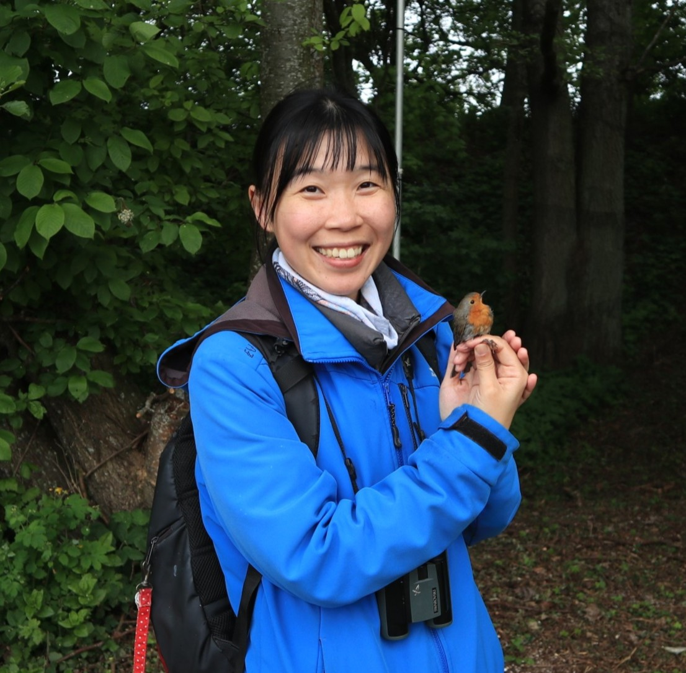

## Sunny Tseng, PhD

::: {.columns}

::: {.column width="65%"}
* **Email:** [sunnyyctseng@gmail.com](mailto:sunnyyctseng@gmail.com)
* **GitHub:** [github.com/SunnyTseng](https://github.com/SunnyTseng)
* **Google Scholar:** [Sunny Tseng](https://scholar.google.com/citations?user=_bHf5NgAAAAJ)
* **LinkedIn:** [linkedin.com/in/sunnytseng](https://www.linkedin.com/in/sunnytseng/)

> I earned my PhD in the spring of 2026 and am currently leading international projects, including an acoustic monitoring study in Lithuania, and working as a software developer with the BirdNET Team at the Cornell Lab of Ornithology, all while launching my business as an independent consultant!
:::

::: {.column width="35%"}
{width="100%" .rounded}
:::

:::

## About me 關於我

Hi there! I was born and raised in Taiwan and now call Vancouver, Canada, my second home. I’ve spent much of my career conducting avian research, which has taken me around the world—from Taiwan and Canada to Lithuania and Arctic Siberia. After completing my PhD in Natural Resources and Environmental Studies, I launched my journey as an independent ecological consultant, specializing in computer programming and ecological data analysis. Outside of work, I enjoy spending time outdoors immersed in nature just as much as I love curling up with a warm cup of tea at home.

哈囉，我是奕晴，來自於一個美麗的熱帶小島 - 臺灣。台大物理系、森林系雙主修畢業後，到加拿大溫哥華就讀碩士班、博士，主要從事鳥類聲學研究。在這些年歲中，於臺灣、加拿大、俄羅斯、立陶宛等世界各地進行研究，收集了三百多種鳥類的鳴唱聲音。曾獲得國家地理頻道 Early Career Grant、加拿大自然科學與工程研究委員會全額研究獎學金。並已在國際期刊發表數篇研究成果。

平時以獨立生態顧問為正職，提供程式設計及分析生態資料(特別是聲音資料)的服務。同時享受藝術創作、寫作、及野外錄音帶來的生活反思，某種程度上，我認為那更能反映出我所認識的世界。看到水會想跳、看到山會想爬、喜歡抱樹、喜歡一個人靜靜地走路、每天要花一個小時吃早餐。目前定居於加拿大溫哥華，另一個靠海的美麗地方，家門口望向海的方向，就是臺灣。

## Long story about me 完整地說

Will be updated soon... :)

靜待更新 ... :D

