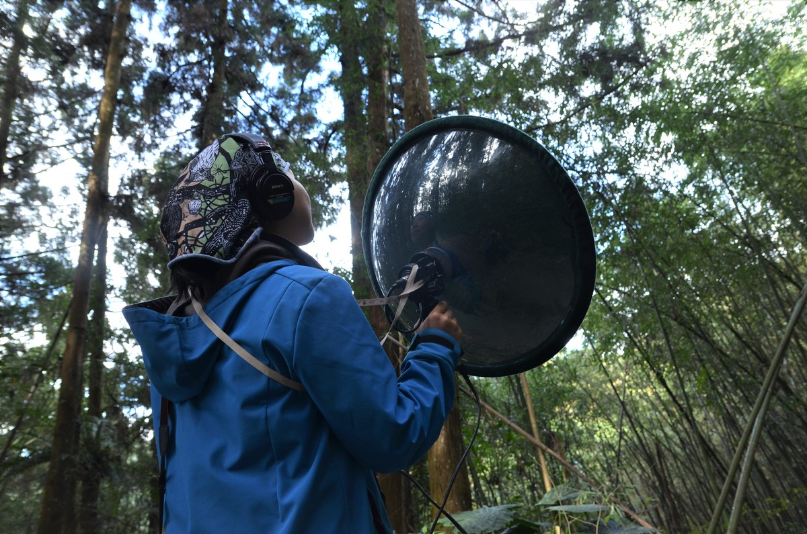

::: {.grid}

::: {.g-col-12 .g-col-md-4}
{.rounded fig-alt="Taiwan"}
:::

::: {.g-col-12 .g-col-md-8}
Welcome to my little wonderland of bird sounds! Field recording brings me deep joy and peace, especially when I was chasing the birds! I've captured about 300 species in various corners of the world, but it isn't about counting numbers... listening to these sounds is how I reconnect with my past journeys.

[<i class="bi bi-soundcloud"></i> Explore complete bird sound collection on Xeno-Canto](https://xeno-canto.org/contributor/SPMWIWZKKC){.btn .btn-outline-primary .btn-sm target="_blank" rel="noopener noreferrer"}
:::

:::


```{=html}
<style>
.bird-map-wrap {
  max-width: 900px;
  width: 100%;
  margin: 2rem auto;
}
#bird-map {
  height: 480px;
  width: 100%;
  border-radius: 6px;
}
.bird-popup {
  max-width: 360px;
}
.bird-popup iframe {
  border: none;
}
</style>

<link rel="stylesheet" href="https://cdnjs.cloudflare.com/ajax/libs/leaflet/1.9.4/leaflet.min.css">
<script src="https://cdnjs.cloudflare.com/ajax/libs/leaflet/1.9.4/leaflet.min.js"></script>


<figure class="bird-map-wrap">
  <div id="bird-map"></div>
  <figcaption style="font-size: 0.85rem; color: #666; margin-top: 0.5rem; text-align: left;">
    Here are a few selected recordings from the locations I've recorded. My main recording hubs are in Taiwan, Canada, and Lithuania.
  </figcaption>
</figure>


<script>
(function() {
  // ---- EDIT THIS ARRAY: one entry per recording ----
  var recordings = [
    { lat: 70.9409, lng: 147.9749, embedUrl: "https://xeno-canto.org/396665/embed" },
    { lat: 62.1143, lng: 129.6997, embedUrl: "https://xeno-canto.org/396615/embed" },
    { lat: 49.2931, lng: -122.3445, embedUrl: "https://xeno-canto.org/490772/embed" },
    { lat: 51.3142, lng: -121.8012, embedUrl: "https://xeno-canto.org/479757/embed" },
    { lat: 54.6692, lng: -124.4144, embedUrl: "https://xeno-canto.org/911367/embed" },
    { lat: 25.0914, lng: 121.7553, embedUrl: "https://xeno-canto.org/538717/embed" },
    { lat: 24.3447, lng: 121.3046, embedUrl: "https://xeno-canto.org/523476/embed" },
    { lat: 35.7664, lng: 139.6295, embedUrl: "https://xeno-canto.org/767536/embed" },
    { lat: -38.5109, lng: 145.1501, embedUrl: "https://xeno-canto.org/871676/embed" },
    { lat: 55.5188, lng: 21.1118, embedUrl: "https://xeno-canto.org/1152643/embed" },
    { lat: 54.8387, lng: 25.4469, embedUrl: "https://xeno-canto.org/1150378/embed" }
  ];
  // ----------------------------------------------------

  var map = L.map('bird-map').setView([recordings[0].lat, recordings[0].lng], 7);

  L.tileLayer('https://{s}.tile.openstreetmap.org/{z}/{x}/{y}.png', {
    attribution: '&copy; OpenStreetMap contributors',
    maxZoom: 18
  }).addTo(map);

  var bounds = [];

  recordings.forEach(function(rec) {
  var popupHtml =
    '<div class="bird-popup">' +
      '<iframe src="' + rec.embedUrl + '" scrolling="no" frameborder="0" width="340" height="220"></iframe>' +
    '</div>';

  var marker = L.marker([rec.lat, rec.lng]).addTo(map);
  marker.bindPopup(popupHtml, { minWidth: 340, maxWidth: 360 });
  bounds.push([rec.lat, rec.lng]);
});

  if (bounds.length > 1) {
    map.fitBounds(bounds, { padding: [30, 30] });
  }
})();
</script>
```


