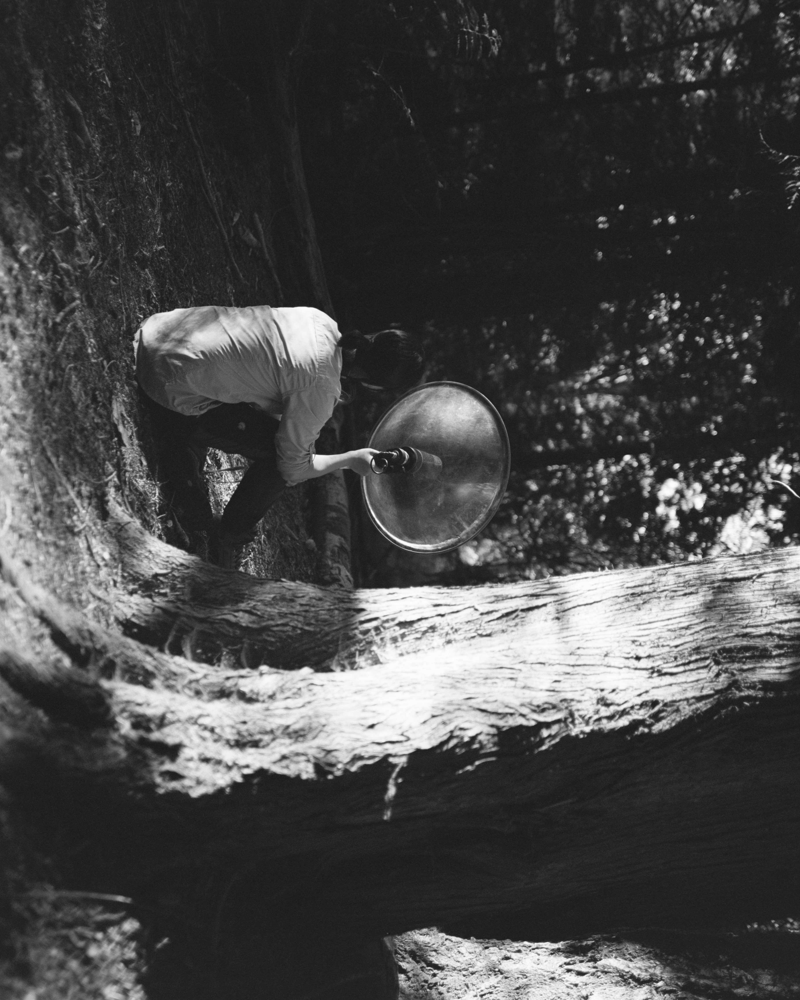

::::: grid
::: {.g-col-12 .g-col-md-4}
{.rounded fig-alt="Vancouver"}

[(Photo credit: Rachele Daminelli)]{.photo-credit}
:::

::: {.g-col-12 .g-col-md-8}
My recordings have been included in a wide range of non-academic works by people around the world — apps, films, podcasts, audiobooks, and art projects. I feel truly fortunate to have made these connections through the sounds we share.
:::
:::::

::::::::::::::::::::::::::: collab-list
:::: collab-row
[🎥]{.collab-icon}

::: collab-body
[YouTube · Jul 2025]{.collab-meta}

[**Emergence Magazine, ep. 2**](https://www.folkfilmmaking.org/Emergence/Seasons/n-SWXRcd){.collab-title}

Adam Amir
:::
::::

:::: collab-row
[📖]{.collab-icon}

::: collab-body
[Article · Jun 2024]{.collab-meta}

[**The Voice of Nature**](https://atmos.earth/art-and-culture/bird-song-the-voice-of-nature/){.collab-title}

Rachele Daminelli
:::
::::

:::: collab-row
[🎧]{.collab-icon}

::: collab-body
[Podcast · May 2021 - present]{.collab-meta}

[**The Science of Birds**](https://www.scienceofbirds.com/){.collab-title}

Ivan Phillipsen
:::
::::

:::: collab-row
[📖]{.collab-icon}

::: collab-body
[App · Mar 2023]{.collab-meta}

[**Collins Bird Guide** — Yellow-billed Loon](https://en.wikipedia.org/wiki/Collins_Bird_Guide){.collab-title}

Lars Svensson
:::
::::

:::: collab-row
[📱]{.collab-icon}

::: collab-body
[App · May 2022]{.collab-meta}

[**Smart Bird Feeder Recognition**](https://mybirdbuddy.com/){.collab-title}

Bird Buddy Team
:::
::::

:::: collab-row
[📖️]{.collab-icon}

::: collab-body
[Audiobook · Apr 2022]{.collab-meta}

[**台灣聲景系列有聲套書**](https://readmoo.com/campaign/2022/3/audiobooks_nature/index){.collab-title}

On The Road 遍路文化
:::
::::

:::: collab-row
[📱]{.collab-icon}

::: collab-body
[App · Sep 2021]{.collab-meta}

[**Larkwire: Learn Birds**](https://www.larkwire.com/){.collab-title}

Phil Mitchell
:::
::::

:::: collab-row
[🎨]{.collab-icon}

::: collab-body
[Artwork · Aug 2021]{.collab-meta}

[**Watching Stories: Naturalist Synesthesia**](https://www.adrienbrun.com/en/naturalist-synesthesia/){.collab-title}

Adrien Brun
:::
::::

:::: collab-row
[🎧]{.collab-icon}

::: collab-body
[Music · Jul 2021]{.collab-meta}

[**休留 Do Not Stop**](https://soundcloud.com/vincent-yu-254738818/demo-0627n-2db){.collab-title}

Vincent Yu
:::
::::

:::: collab-row
[🎥]{.collab-icon}

::: collab-body
[YouTube · Feb 2021]{.collab-meta}

[**Bird Watching Life**](https://www.youtube.com/channel/UCPnvITsrkMRYAVQcNFmH2tg){.collab-title}

Brian Westland
:::
::::

:::: collab-row
[🎥]{.collab-icon}

::: collab-body
[YouTube · Dec 2019]{.collab-meta}

[**10 Ways to Help Birds (and the Environment)**](https://www.youtube.com/watch?v=ulu2x397Tnk){.collab-title}

Colin Durfee
:::
::::

:::: collab-row
[🐦]{.collab-icon}

::: collab-body
[Xeno-canto · Dec 2017]{.collab-meta}

[**North East Siberia — Webpage Spotlight**](https://www.xeno-canto.org/collection/spotlight/105){.collab-title}

Willem-Pier Vellinga
:::
::::
:::::::::::::::::::::::::::
